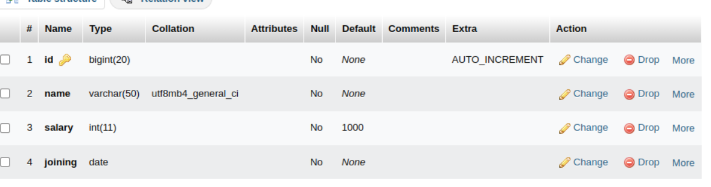
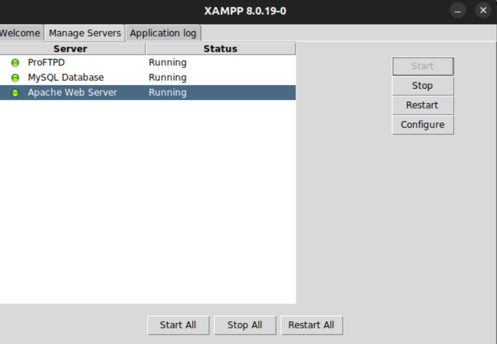

# LOYAL-EMPLOYEES
This is a simple PHP API which takes information from a MYSQL database about employees of a company,
and marks the employees who have been at the company for more than 5 years with green.

## DATABASE
The database used for this is MySQL. The database schema looks something like this.


## RUNNING IT LOCALLY
To run this locally on your machine follow these steps:

### Clone this repository
 ``` git clone  https://github.com/PranshuSrivastava/Loyal-Employees.git ```

 ### Download and install the xampp application from the from here
 https://www.apachefriends.org/download.html

 ### Start the servers
 

 ### On your browser, type
 http://localhost/zylu/api/post/read.php